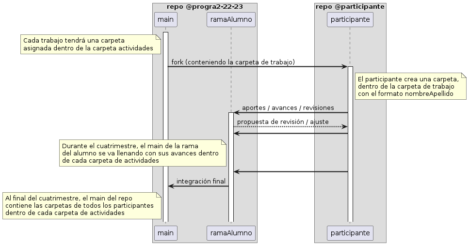

# Carpeta para entregas...
> Por favor, lee cuidadosamente las siguientes instrucciones antes de comenzar a trabajar en cualquier ejercicio.

Crear una carpeta nombrada nombreApellido y dentro de ella los códigos fuentes para revisar.

> Ex: elderBol > ejercicioUno

> Hacer el PR a la rama **nombreApellido**

# Estrategia de trabajo

> Para cada ejercicio, se recomienda crear una nueva rama en el repositorio de GitHub y, posteriormente,
  solicitar un Pull Request. De esta manera, se podrá mantener un registro claro y organizado de cada ejercicio, lo que facilitará su revisión y seguimiento.

## Gestión de dudas y cuestiones

A través de los [Discussions](https://github.com/eabol/progra2-22-23/discussions) del repositorio, utilizando menciones

## Entrega de ejercicios
1. Clonar tu repositorio de la asignatura o actualizarlo si ya lo tenías clonado.
2. Crea una nueva rama con un nombre claro y descriptivo que indique el propósito del ejercicio. 
3. Modifica el código según lo requerido por la especificación del proyecto. 
4. Realiza pruebas exhaustivas para asegurarte de que tus cambios cumplen con los criterios de aceptación. 
5. Haz commit de tus cambios y súbelos a la rama que creaste. 
6. Envía una solicitud de extracción (Pull Request) a la rama principal para que se revise tu código. 
7. Una vez que tu solicitud de extracción sea aprobada y fusionada, elimina la rama que creaste.

