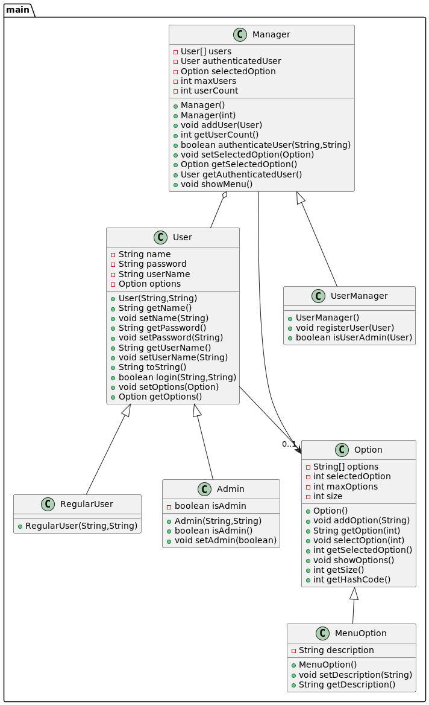

# About EX003Inheritance solution

> This is a basic documentation about the solution for the [EX003Inheritance](https://github.com/eabol/progra2-22-23/blob/main/ejercicios/EX003-Inheritance.md) exercise.

For demonstration purposes, the solution is divided into two parts:
1. The first part is a simple Main class that simulates the execution of the exercise as a Bank system.
2. The second part is a set of unit tests that verify the correctness of the solution.

## How to run the solution  
1. Go to the [src](src) folder.
2. Compile the solution using the java compiler with the following command in your terminal:
```bash
  javac -d ../out main/*.java
```
3. Run the solution using the java interpreter with the following command in your terminal:
```bash
  java -cp ../out/production/EX003Inheritance Main
```

## How to add JUnit 5 jupiter to your IDE
1. Go to the [lib](lib) folder.
2. Download the JUnit 5 jupiter jar file.
3. Add the jar file to your IDE.
4. Add the jar file to your project.

## Final diagram
> This diagram shows a very near representation of the solution, for more details, please check the code.
